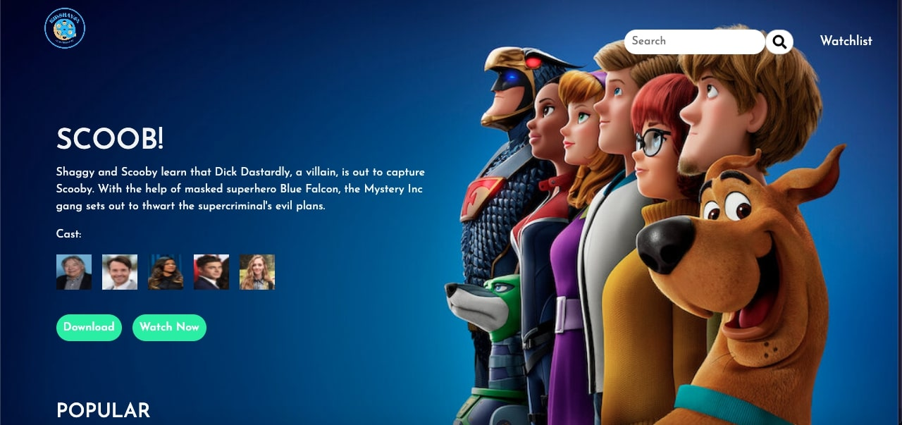

 # CHILDREN'S MOVIE REVIEW WEBSITE
 This is a responsive [children's and teen movie review website](https://kidshaven.netlify.app/). It's tailored to this specific age group and provides reviews to the movies and series.

 This is a team project I worked on as part of my Visiola Foundation Coding Bootcamp and it came in first place during the final project pitch session
 
 Link to live website: https://kidshaven.netlify.app/

 ## Screenshots of the site
 

 ### I have also coded out the first review page "Cinderella"
 

 ## Technologies used
 <ul>
 <li>HTML5</li>
 <li>CSS3</li>
 <li>Bootstrap 5</li>
 </ul>

 ## Libraries used
 <ul>
 <li>Fontawesome5 Icons</li>
 </ul>

